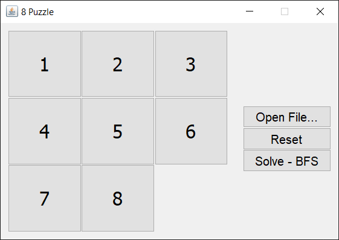
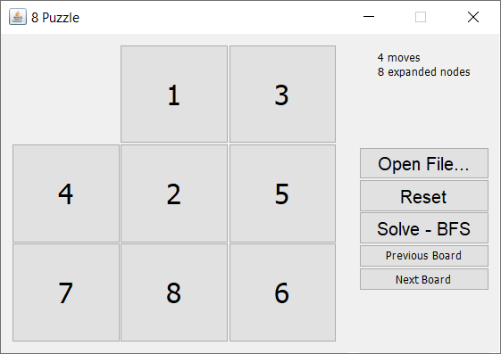

# CMSC 170 8 Puzzle BFS Solver with GUI

compile with
`javac -d bin *.java`

run with
`java -cp bin EightPuzzle`

Functionalities:

* reads input file `puzzle.in` for board face/configuration
* when solve-bfs button is clicked, disables board and previous and next board button show the solution path
* outputs `puzzle.out` file that contains solution path moves

